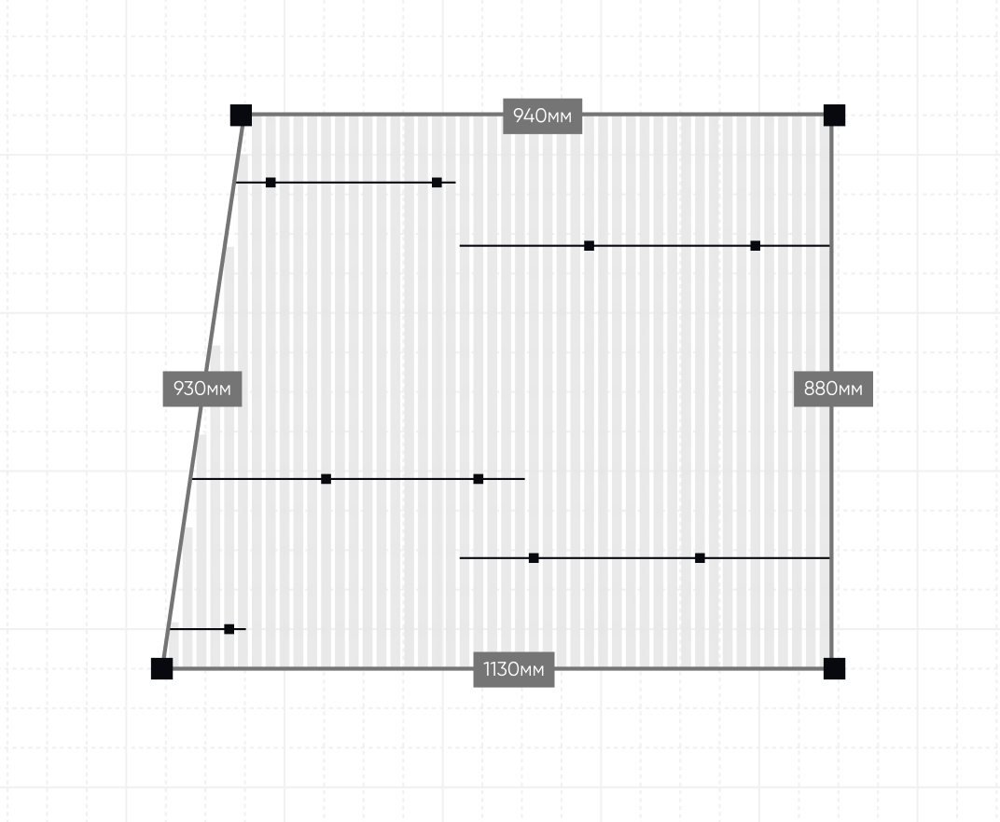

# Alfaspo - Система проектирования подвесных потолков

**Описание:**  
Веб-приложение для автоматизированного расчета и проектирования подвесных потолков с интерактивным редактором помещений и алгоритмом оптимизации размещения панелей и стрингеров.

**Бизнес-ценность / Применение:**  
Система предназначена для строительных компаний и дизайнеров интерьеров, позволяя автоматически рассчитывать количество материалов, стоимость и создавать технические чертежи для подвесных потолков различных типов (сталь, алюминий, акустическая повсть).

**Ключевые функции:**

-   [ ] Интерактивный редактор помещений с векторной графикой (SVG.js)
-   [ ] Алгоритм автоматического размещения панелей с учетом ограничений материалов
-   [ ] Оптимизация расположения стрингеров с проверкой пересечений
-   [ ] Расчет стоимости и веса конструкции в реальном времени
-   [ ] Поддержка множественных помещений в одном проекте
-   [ ] Генерация технических чертежей в формате SVG
-   [ ] Система управления ценами и материалами через админ-панель

**Технологии:**

-   **Backend:** PHP 8.1, Laravel 10, MySQL
-   **Frontend:** React 18, TypeScript, SVG.js, SCSS
-   **Инструменты:** Vite, Tailwind CSS, Alpine.js
-   **Дополнительно:** DOMPDF для генерации PDF, Livewire для динамических компонентов

**Демо-сценарии:**

-   Проектирование подвесного потолка для офисного помещения с автоматическим расчетом материалов
-   Создание многоуровневой конструкции с различными типами панелей и стрингеров

